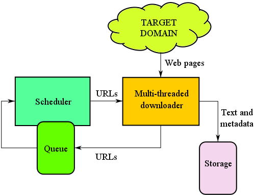

# KRAWLER: A WEB CRAWLER IN PYTHON3

It's a simple multithreaded web crawler wich downloads and stores web pages.

			

Project Source code:
---
	See inside src/*

Project docs:
---
	See inside docs/*

Installing the system-wide dependencies:
---
    $ bash system-dependencies.sh
    $ sudo pip3 install -U -r requirements.txt

Starting the crawler:
---
	$ pushd src; python3 main.py; popd
	

